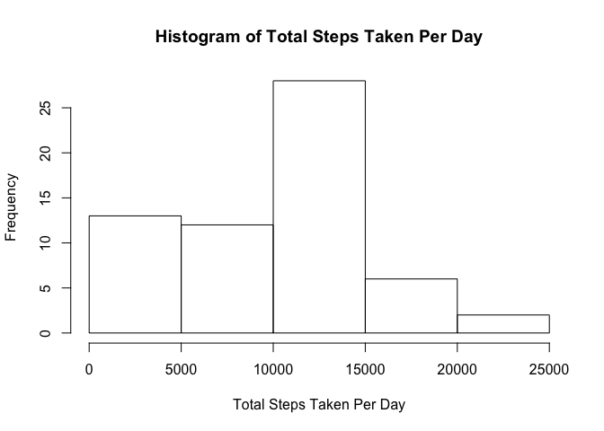
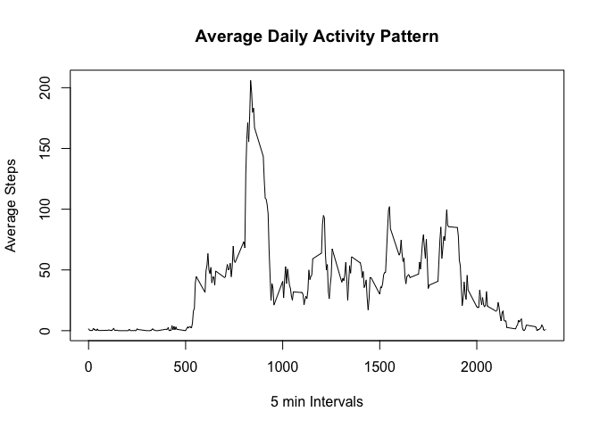
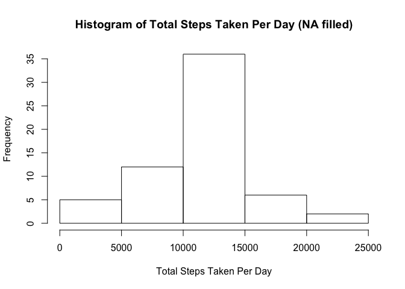
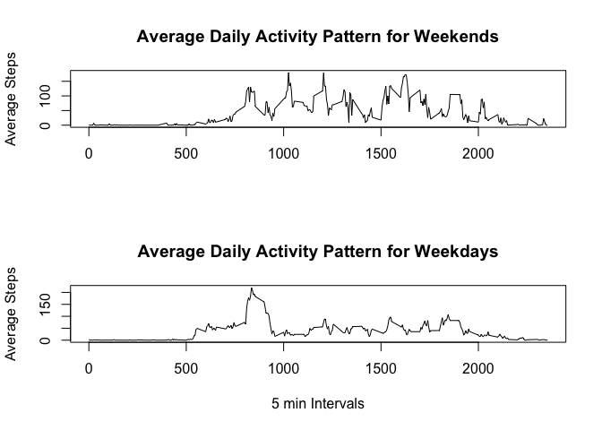

# Reproducible Research: Peer Assessment 1


## Loading and preprocessing the data

* [Data Resource](https://d396qusza40orc.cloudfront.net/repdata%2Fdata%2Factivity.zip)
* Loading and preprocessing the data


```r
## Download and Unzip Data File
url<-"https://d396qusza40orc.cloudfront.net/repdata%2Fdata%2Factivity.zip"
file<-"temp.zip"
download.file(url,file)
unzip(file)
## Read Data
dat <- read.csv("activity.csv")
```
* Data structure:
  + Steps: Steps measured (NA for missing data)
  + Date: Date when the activities were measured
  + Interval: 5 min intervals when the activities were measured

```r
summary(dat)
```

```
##      steps                date          interval     
##  Min.   :  0.00   2012-10-01:  288   Min.   :   0.0  
##  1st Qu.:  0.00   2012-10-02:  288   1st Qu.: 588.8  
##  Median :  0.00   2012-10-03:  288   Median :1177.5  
##  Mean   : 37.38   2012-10-04:  288   Mean   :1177.5  
##  3rd Qu.: 12.00   2012-10-05:  288   3rd Qu.:1766.2  
##  Max.   :806.00   2012-10-06:  288   Max.   :2355.0  
##  NA's   :2304     (Other)   :15840
```
## What is mean total number of steps taken per day?
* Histogram of total steps taken per day

```r
## Calculate total steps for each day
totalsteps<-with(dat,tapply(steps,date,sum,na.rm=TRUE))
## Plot histogram
hist(totalsteps,xlab="Total Steps Taken Per Day", main="Histogram of Total Steps Taken Per Day")
```

<!-- -->

* Mean total number of steps per day

```r
with(dat,mean(tapply(steps,date,sum), na.rm=TRUE))
```

```
## [1] 10766.19
```
* Median total number of steps per day

```r
with(dat,median(tapply(steps,date,sum), na.rm=TRUE))
```

```
## [1] 10765
```
## What is the average daily activity pattern?
* Average daily activity pattern

```r
## Calculate average daily activity
averagesteps<-with(dat,tapply(steps,interval,mean,na.rm=TRUE))
## Plot average daily activity with 5 min intervals
plot(names(averagesteps),averagesteps,type="l",xlab="5 min Intervals", ylab="Average Steps", main="Average Daily Activity Pattern")
```

<!-- -->

* The 5-minute interval that, on average, contains the maximum number of steps

```r
names(which.max(averagesteps))
```

```
## [1] "835"
```

## Imputing missing values

* Number of missing data

```r
sum(is.na(dat$steps))
```

```
## [1] 2304
```

* Filling the missing value with average actiivty for that 5 min interval

```r
dat$steps[is.na(dat$steps)]<-averagesteps
```

* Histogram of total steps taken per day for new data set

```r
## Calculate total steps for each day
totalsteps<-with(dat,tapply(steps,date,sum))
## Plot histogram
hist(totalsteps,xlab="Total Steps Taken Per Day", main="Histogram of Total Steps Taken Per Day (NA filled)")
```

<!-- -->

* Mean total number of steps per day for new data set

```r
with(dat,mean(tapply(steps,date,sum), na.rm=TRUE))
```

```
## [1] 10766.19
```
* Median total number of steps per day for new data set

```r
with(dat,median(tapply(steps,date,sum), na.rm=TRUE))
```

```
## [1] 10766.19
```
## Are there differences in activity patterns between weekdays and weekends?
* Add a new column of factors indicating weekday/weekend

```r
Weekend<-c("Saterday","Sunday")
## Create a new column of factor
dat$weekday<-ifelse(weekdays(as.Date(dat$date)) %in% Weekend, "weekend","weekday")
## Subset weekend data
weekenddat<-subset(dat,dat$weekday=="weekend")
## Subset weekday data
weekdaydat<-subset(dat,dat$weekday=="weekday")
```

* Plot average daily activity patterns for weekends and weekdays


```r
## Set the panel
par(mfrow=c(2,1))
## Calculate and plot average daily activity pattern for weekends
averagesteps<-with(weekenddat,tapply(steps,interval,mean,na.rm=TRUE))
plot(names(averagesteps),averagesteps,type="l",xlab=NA, ylab="Average Steps", main="Average Daily Activity Pattern for Weekends")
## Calculate and plot average daily activity pattern for weekends
averagesteps<-with(weekdaydat,tapply(steps,interval,mean,na.rm=TRUE))
plot(names(averagesteps),averagesteps,type="l",xlab="5 min Intervals", ylab="Average Steps", main="Average Daily Activity Pattern for Weekdays")
```

<!-- -->
